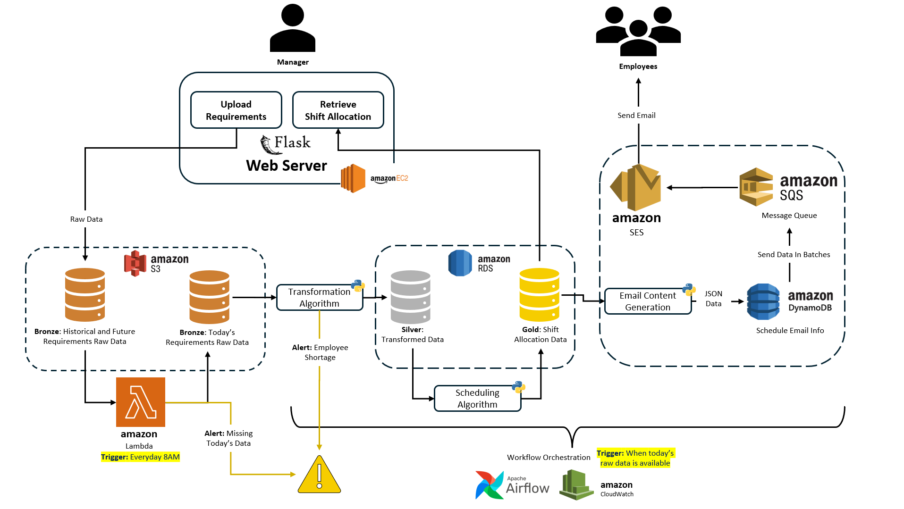

# CUBoulder-Shift-Scheduler




This repository contains the code and instructions to automate the employee scheduling system for CU Bookstore. The system is designed to streamline the scheduling process by collecting employee availability and shift requirements, then using AWS services, Python scripts, and Flask to generate and notify employees of their assigned shifts.


## Setup Instructions

Follow these steps to set up and run the project locally and connect to AWS services.

### 1. Connect to EC2 Instance

Connect to the EC2 instance using its public IP. Make sure the instance has port 5000 open.

```bash
ssh -i "your-key.pem" ec2-user@<EC2_PUBLIC_IP>
```

### 2. Clone the GitHub Repository

Once connected to your EC2 instance, clone the repository to your local machine by running the following command:

```bash
git clone git@github.com:Arnav-Purushotam-CUBoulder/CUBoulder-Shift-Scheduler.git
```

### 3. Create and Activate a Virtual Environment

Next, create a virtual environment and activate it. Here’s how you can do it for macOS:

```bash
python3 -m venv venv
source venv/bin/activate
```

### 4. Install Required Packages

Once your virtual environment is activated, install all the required packages listed in `requirements.txt` by running:

```bash
pip install -r requirements.txt
```

### 5. Run the Flask Application

To run the Flask application, use the following command:

```bash
python3 app.py
```

This will start the Flask app on port 5000.

### 6. Create an S3 Bucket and Input Folder

- Log in to your AWS account.
- Go to **S3** and create a new bucket.
- Inside the bucket, create a folder named `input`.

### 7. Upload Input Files

In the S3 bucket’s `input` folder, download the following two files:

- `01_Emp_Availability_Initial.xlsx`
- `02_Emp_Count_Requirement.xlsx`

Once these files are uploaded, open the front-end application in your browser and hit submit to start the scheduling process.

### 8. Set Up Lambda Function

To automate the process, create a Lambda function that triggers every day at 8 AM to fetch the respective day's file:

1. In the Lambda Console, create a new function.
2. Upload the script `lambda.py` to Lambda.
3. Create a test event and run the function manually or wait for it to trigger automatically at 8 AM.

### 9. Create RDS Database

Create an RDS database in AWS and set up the schema using the scripts provided in the `RDS Scripts` folder. This will enable you to store processed data in a relational database.

### 10. Create DynamoDB

Create a DynamoDB table from the UI in AWS. This will be used to store email content for notifications.

### 11. Create SQS Message Queue

Create an SQS message queue in AWS and set up a table. Additionally, configure SES (Simple Email Service) to send emails and verify your email ID to enable notifications.

### 12. Trigger Airflow Manually

Although Airflow is set to trigger automatically, you can test it manually:

1. Create an Airflow DAG.
2. Inside the existing bucket, create a `dag` folder and upload the files from the `Code` folder.
3. **Edit the files** in the `Code` folder to change the SQS table name, SES endpoint, and DynamoDB endpoint to match your AWS resources.
4. Start the DAG in Airflow. The DAG consists of 3 different pipelines:
   - **Transformation**: Data processing and transformation.
   - **Scheduling**: Assigning shifts based on employee availability and operational needs.
   - **Emailing**: Sending notifications to employees about their shift assignments.

### 13. Wait for the Process to Complete

Once the DAG runs, wait for about 5 minutes for the process to complete. The system will automatically handle the transformation, scheduling, and email notification steps.

### 14. Employee Notifications

After the process finishes, employees will receive an email notification about their assigned shifts and working hours.

